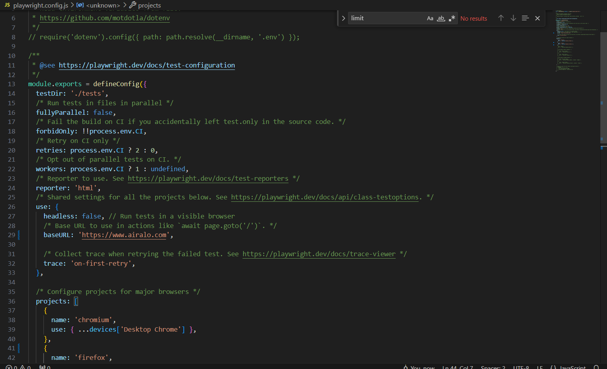
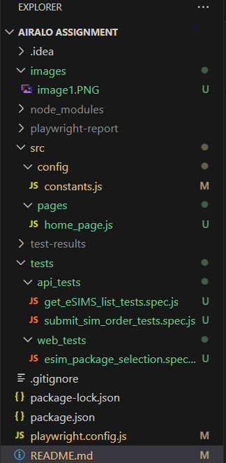
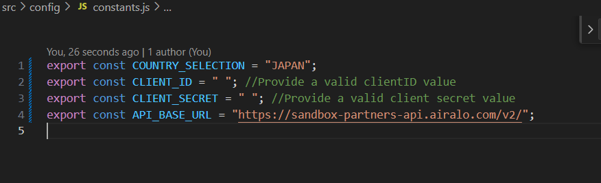
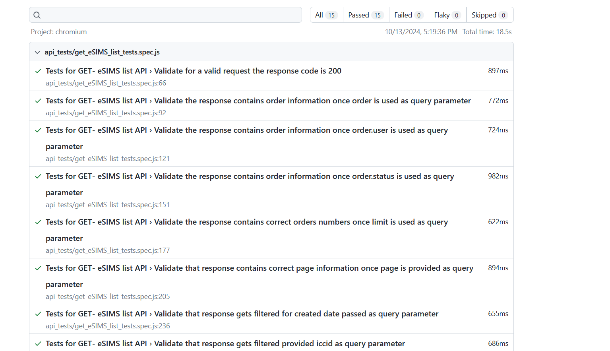

# Airalo-Tests
This project is a Playwright-based testing suite designed to evaluate and verify the functionality of Airalo Application. Playwright, a Node.js library for browser and API automation, enables reliable and efficient testing of web applications across multiple browsers, as well as API interactions. By leveraging Playwright, this suite ensures thorough and consistent testing coverage for Airalo Package Selection, promoting functionality and stability across various environments.

## Table of Contents
- [Features](#features)
- [Installation](#installation)
- [Configuration](#configuration)
- [Techology Stack](#techstack)
- [Design Pattern](#designpattern)
- [Naming Conventions](#namingconventions)
- [Test Execution](#testexecution)
- [Test Results](#testresults)

## Features

- **Web Automation**: Automated Web tests for eSim package selection.

- **Hooks**: The test.beforeAll hook is a setup function that runs once before all the tests in the suite. Its purpose is to establish a new request context using Playwright's API, and it handles authentication by obtaining an access token.

- **API Tests Automation**: Using playwright, API tests for Get eSIM List and Submit Order are automated


## Installation
```bash
# Install NodeJs and npm
 Windows : https://nodejs.org/en 
 macOS: https://nodejs.org/en/download/package-manager

# Navigate to the project directory
cd Airalo-Tests

# Install dependencies
npm install
```
## Configuration
The Playwright configuration file (playwright.config.js) is located in the root directory. Customize it according to your needs. For example, you can configure test execution mode, browsers, set base URL.



## Tech Stack
This project uses the following technologies and tools:

### 1. **Playwright**
- **Description**: A Node.js library for browser automation [Playwirght Documentation](https://playwright.dev/docs/intro)
- **Usage**: Allows end-to-end testing by interacting with browsers programmatically.

### 2. **Javascript**
- **Description**:   JavaScript is a high-level, versatile programming language primarily used for client-side scripting in web development. 
- **Usage**: 
In this project, JavaScript serves several key roles:
  - **Test Scripting**: JavaScript is used to write test scripts for automating interactions with the web application. This includes actions like clicking buttons, filling out forms, and verifying page content.
  - **Integration with Playwright**: Playwright, a Node.js library for browser automation, relies on JavaScript to define and execute tests. 
  - **Asynchronous Operations**: JavaScript's support for promises and async/await syntax allows for handling asynchronous operations in a clean and manageable way. This is crucial for interacting with web elements that might load or change dynamically.
  
  ## Design Pattern
  For organizing and maintaining code, making it more readable, reusable, and easier to manage the Page Object Model (POM) a design pattern is used in this project.This design creates a layer of abstraction between the test scripts and the application’s user interface. For further details, please refer to the [Playwirght Documentation for POM](https://playwright.dev/docs/pom)
  Here in this screenshot, you can see that home page objects and functions class is created in pages folder and the relevant test of this class are added in the test folder.
  
  

 ## Naming Conventions
#### Lower Camel Case:
Used for variables, functions
#### Upper Camel Case : 
Used for Classes
#### Snake Case:
Used for project files

## Web Automated Test Overview
The package_selection_tests.spec.js file, located in the tests folder, includes an automated test titled "Search and verify package details for Japan eSIM". This test performs a series of interactions on the Airalo website homepage to verify the details of the Japan eSIM package. Here’s an overview of what the test accomplishes:

#### Test Steps:
Navigate to Airalo Website: The test begins by navigating to the Airalo homepage.

#### Handle Privacy Notices and Notifications:
It accepts any privacy notices that appear.
It conditionally allows notifications based on whether the test is running in headless mode (notifications are only allowed in non-headless mode).

#### Change Currency and Search for Japan eSIM Package:
The currency is switched from Euro to USD for accurate pricing details.
The test then searches for the Japan eSIM package and selects the first package available.

#### Retrieve and Verify Package Details:
After selecting the package, the test retrieves important package information, including the package title, coverage, data, validity, and price.
These details are then compared against expected values using assertions to ensure they match the criteria.

#### Assertion Handling:
##### Soft Assertions:
 If any assertions fail, the test collects the error messages and reports them at the end of the test run. This approach, known as "soft assertion," allows the test to document multiple assertion failures within a single execution, providing a comprehensive report of any issues found.

This test ensures that the correct Japan eSIM package details are presented, thereby validating the accuracy of the information displayed on the website.

## API Automated Test Overview
Files order_submission_tests.spec.js and sims_fetching_tests.spec.js contain API for API (Submission Order and Get sIMS Lists). Following are the details

### Setup and Teardown
### Setup (beforeAll): 
Authenticates with the API before running tests, obtaining an access token to be used for authorization.

### Teardown (afterAll): 
Disposes of the request context to release resources after tests complete.
### Authorization: 
All requests include an authorization header with a Bearer token, retrieved at the start of the test suite
### Submit Order Endpoint Automated Tests Details

#### Submit a New Order and Validate Success (200):
Objective: Verifies that a valid order submission returns a 200 status code.

Actions: Sends a request with valid order details including quantity, package ID, type, and description.

Assertions: Checks the status code and validates that the response contains the correct order details.

#### Validate Unauthorized Access (401):

Objective: Ensures the API enforces authentication by checking that an unauthenticated request is denied.

Actions: Sends a request without a valid token.

Assertions: Verifies the status code is 401, confirming unauthorized access is properly blocked.

#### Validate Malformed Request Body (422):

Objective: Confirms that the API handles invalid input by returning a 422 status code.

Actions: Submits a request with an extra, unexpected field.

Assertions: Checks that the server responds with 422, indicating unprocessable input.

#### Validate Missing Mandatory Fields (422):

Objective: Ensures the API responds appropriately when required fields are omitted.

Actions: Sends a request missing key fields like quantity and package ID.

Assertions: Validates the response code is 422 and checks error messages for missing fields.

#### Validate Excessive Quantity and Invalid Package ID (422):

Objective: Tests the API's response to an order with a quantity exceeding limits and an invalid package ID.

Actions: Sends a request with a quantity above the maximum limit and an invalid package ID.

Assertions: Confirms the response code is 422 and that specific error messages are returned for both issues.

### Get eSIMs Lists Endpoint Automated Tests Details
#### Successful Response Verification:
Ensures that a valid request to the eSIMs endpoint returns a 200 status code, confirming basic API accessibility and authentication.

#### Order Information with Query Parameter (include=order):
Verifies that including order in the query returns the correct link for the first page in the response, confirming correct inclusion of order data.

#### Order and User Information (include=order.user):

Checks if order.user in the query returns a link indicating the correct endpoint, ensuring user information is retrieved along with order data.
#### Order Status Information (include=order.status):

Validates that the order.status query parameter returns data that includes order status, ensuring the API handles nested data structures accurately.
#### Limited Number of Orders (include=order&limit=2):

Confirms that setting a limit on the number of orders results in exactly two entries in the response, verifying correct handling of the limit parameter.
#### Pagination Handling (page=2):

Verifies that specifying a page number returns data for that page, checking if the API correctly supports pagination.
#### Date Filtering (filter[created_at]=YYYY-MM-DD):

Tests the filter[created_at] parameter to ensure that the API returns only data entries within a specified date range, validating date filtering functionality.
#### ICCID Filtering (filter[iccid]=ICCID_VALUE):

Ensures that filtering by a specific ICCID value correctly narrows down the response to that ICCID, confirming ICCID-based filtering.
#### Malformed Request Handling (include=order&limit=ABC):

Tests an invalid limit value (non-integer) to verify that the API returns a 422 error code and an appropriate error message, demonstrating robust input validation.

 ## Test Execution
```bash
# Navigate to the project directory
cd Airalo-Tests

# Add client id and secret values to constant.js file
```
  

```bash
# to execute the Web test in headless mode
In the playwright.config.ts file check browser property  headless: true,

# to execute the Web test in UI mode
In the playwright.config.ts file check browser property  headless: false,

# execute command
npx playwright test

 ## Test Results
 Test results are shown in a default html report that is configured in the playwright.config.ts file
 ```bash
# to view the result report
 npx playwright show-report
```
 
